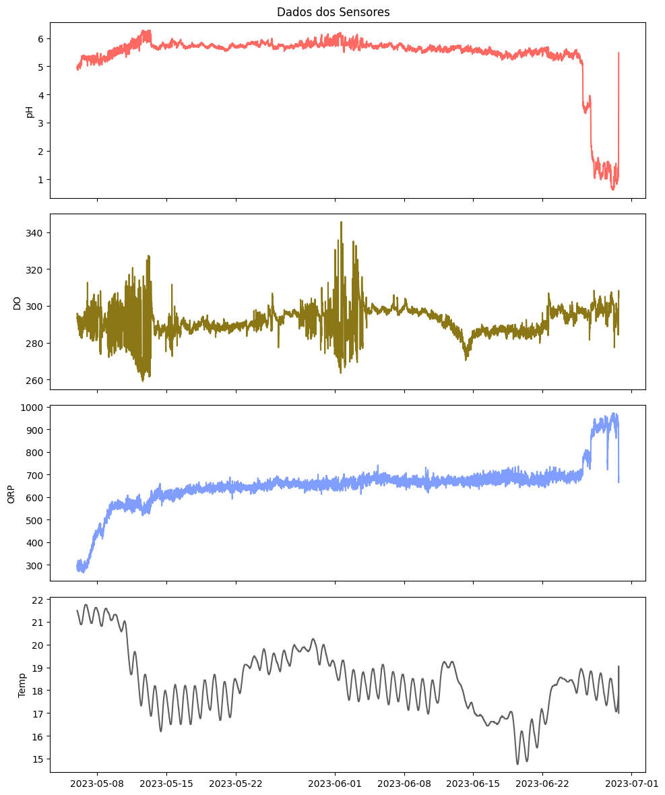

# Repositório de Dados do Teste na Plataforma Flutuante da Sanepar de Toledo

Este repositório contém os dados coletados de uma plataforma flutuante que foi instalada na plataforma de elevação de água da Sanepar em Toledo, durante o período de 4 de maio de 2023 a 28 de junho de 2023. Os parâmetros monitorados incluem pH, DO (Oxigênio Dissolvido), ORP (Potencial de Redução de Oxidação) e Temperatura. 

Os dados brutos estão localizados no arquivo `data.csv`, enquanto os dados formatados estão no arquivo `data-normalizado.xlsx`.

⚠️ **Atenção:** Note que a data do RTC estava errada em um mês durante a coleta de dados. Para corrigir isso, você precisará incrementar as datas em 31 dias.

Os dados dos sensores na plataforma flutuante foram registrados a cada 20 segundos. Para facilitar a análise, realizamos uma plotagem desses dados, que estão contidos no arquivo Jupyter notebook `Plataforma.ipynb`. Essa plotagem compreende todo o período de teste, com os dados agrupados em intervalos de 10 minutos por meio de uma média simples.

## Visualização de Dados 

Para visualizar os dados coletados na plataforma flutuante, você pode abrir o arquivo `Plataforma.ipynb`. Abaixo, é apresentado um gráfico geral dos dados coletados durante o período do teste.

Por favor, note que este é um exemplo básico. Você pode ajustar o código conforme necessário para atender às suas necessidades de visualização de dados. 

Os gráficos resultantes fornecem uma visão clara das variações nos parâmetros medidos ao longo do tempo.
